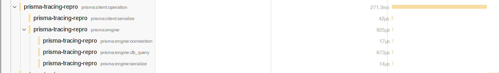

1. Run docker compose to start db and Jaeger.
2. Run pnpm install.
3. Run pnpm run trace.
4. Open Jaeger http://localhost:16686
5. Pick prisma-tracing-repro service, last 5 minutes, Min Duration 1s, Limit results 1000. Click Find Traces.
6. Sort by longest. Click on longest trace.
7. `prisma:client:operation` does not have all the duration covered.

Image

